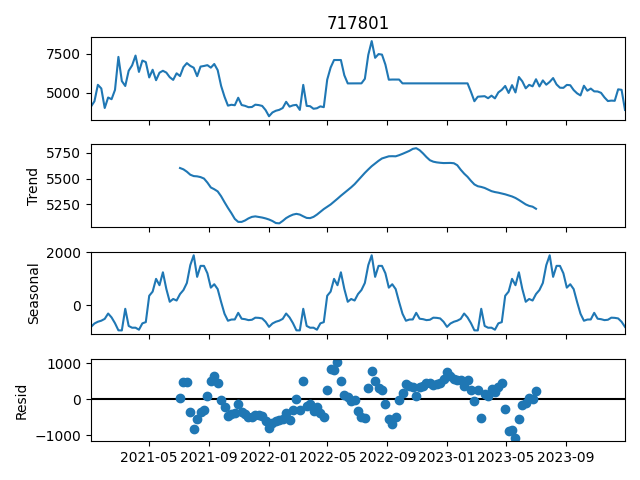
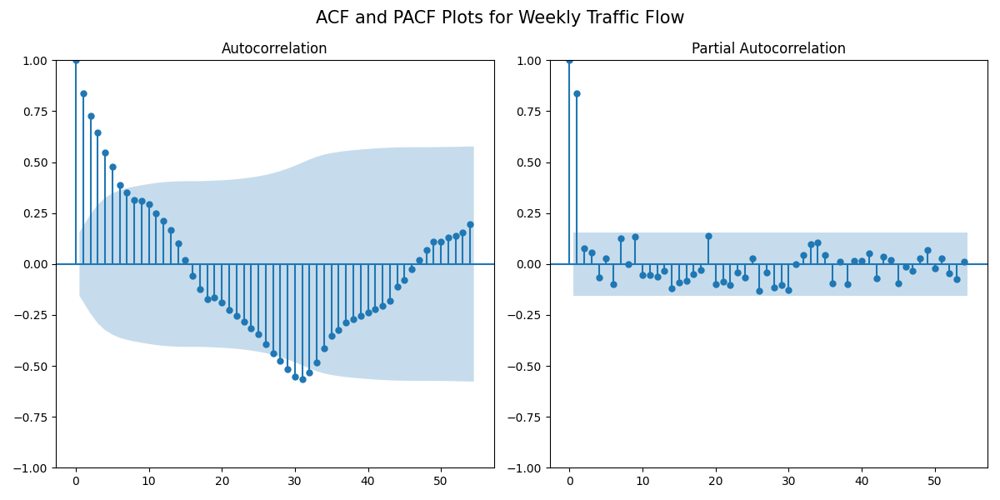

# I-405 Traffic Flow Forecasting

## [Part 1: Intro and Data Cleaning](code/01-Intro-and-data-cleaning.ipynb)
---
### 1. Introduction 

#### Problem Statement

Traffic congestion on the I-405 Freeway in Los Angeles area is a significant challenge, impacting travel times, air quality, and overall commuter experience. The dynamic nature of traffic flow is influenced by numerous factors, including time of day, day of the week, special events(holidays, constructions), and weather conditions. Predicting future traffic flow accurately can enable better traffic operation management, early warnings for congestion, and optimized route planning.

This study aims to compare and evaluate the performance of three prediction models: Vector Autoregression (VAR), Facebook Prophet, and Long Short-Term Memory (LSTM) neural networks in forecasting traffic flow on the I-405 Freeway, while incorporating weather data as exogenous factors. The goal is to identify the most effective model for accurate traffic prediction, leveraging the combination of historical traffic data and weather information.

The models will be evaluated using two common performance metrics: Mean Absolute Error (MAE) and Root Mean Squared Error (RMSE). These metrics will assess their prediction accuracy and model robustness. By comparing these models, the study seeks to contribute to the development of more efficient traffic prediction systems that can assist in alleviating congestion and enhancing urban mobility in the Los Angeles area.

#### Data

**Traffic flow data** is from Caltrans Performance Measurement System [(PeMS)](https://pems.dot.ca.gov/). The traffic data is collected from over 39,000 individual detectors. These sensors span the freeway system across all major metropolitan areas of the State of California. PeMs also provides over ten years of data for historical analysis. It integrates a wide variety of information from Caltrans and other local agency systems.

In the data/traffic-data folder, it contains hourly traffic flow data for the segment of I-405 north bound in Los Angeles County from Jan. 01, 2021 to Dec. 31, 2023. Original data stores in excel files in monthly manner.

**Weather data** is from [Meteostat](https://dev.meteostat.net/python/) Python package.

### 2. Data Cleaning

- Identify missing values
    - There is a 3-day gap in the timestamps.
- Missing values imputation: 
    - Impute the missing datat with KNN Imputer

## [Part 2: EDA](code/02-EDA.ipynb)
---

### 3. Exploratory Data Analysis

Resample the traffic flow data and analyze the monthly, weekly, daily and hourly traffic flow in the following parts:

- Seasonal decomposition: plot seasonal decoposition each resampled data.
    - weekly seasonal decomposes 
    
- Correlation: Autocorrelation and partial autocorrelation analysis.
    - weekly acf and pacf
    
- Stationarity testing: Use Augmented Dickey-Fuller unit root test to check if the data is stationary.

## [Part 3: Modeling and Conclusion](code/03-Modeling.ipynb)
---

### 4. Modeling and Evaluation
**Modeling**

* Naive Forecast(baseline model)
* VAR (Vector Autoregressive)
* Prophet
* LSTM (Long Short-Term Memory)

Compare the performance of each model for forecasting traffic flow on the I-405 freeway LA segment. The performance of these models is assessed based on RMSE (Root Mean Squared Error) and MAE (Mean Absolute Error), with lower values indicating better performance.

**Evaluation**

**Results**

    
| Time Granularity | Baseline RMSE | Baseline MAE | VAR RMSE | VAR MAE | Prophet RMSE | Prophet MAE | LSTM RMSE | LSTM MAE |
|------------------|---------------|--------------|----------|---------|--------------|-------------|-----------|----------|
| Monthly          | 3966.27       | 3428.63      | 510.44   | 424.80  | 2092.87      | 1666.75     | NA        | NA       |
| Weekly           | 3966.27       | 3428.63      | 518.11   | 421.54  | 497.31       | 418.09      | 766.69    | 701.04   |
| Daily            | 3966.27       | 3428.63      | 628.56   | 410.73  | 564.88       | 499.32      | 685.79    | 511.25   |
| Hourly           | 3966.27       | 3428.63      | 2081.83  | 1772.04 | 601.04       | 432.05      | 1618.27   | 1228.21  |

The result table provides a comparison of the RMSE and MAE values for different time granularities: Monthly, Weekly, Daily, and Hourly. These time granularities are essential for traffic forecasting as they represent different levels of resolution in predicting traffic patterns.

**Baseline**
* The baseline model is a naive forecast that uses the last value from the training set and continues it into the future.
* This simple assumption leads to high RMSE and MAE values across all granularities, indicating poor forecasting performance.

**VAR**
* The VAR model performs better than the Baseline model, particularly for monthly and weekly forecasts.
* VAR performed poorly for hourly granularities.
* VAR model is effective for capturing longer-term trends and relationships between multiple variables in traffic data.
* VAR struggles with high-frequency forecasting (in this study: hourly traffic flow), where traffic can be highly volatile due to factors such as accidents, road closures, or other sudden events.

**Prophet**
* The Prophet model shows strong performance at monthly and weekly granularities, similar to the VAR model. However, it also starts to lose accuracy as the time granularity becomes finer, particularly for daily and hourly traffic flow forecasts.
* It performs especially well at weekly forecasts, capturing the cyclical nature of traffic patterns, which can be influenced by workweek schedules, holidays, and weather conditions.
* While Prophet can model seasonality and holidays, it struggles when forecasting very high-frequency data (hourly), where short-term fluctuations and events (such as accidents) may be more significant.

**LSTM**
* It performs well at daily and weekly granularities but struggles at hourly forecasting, likely due to the complex and noisy nature of traffic flow at hourly frequency.
* The model may overfit to short-term noise, which leads to poor performance for hourly forecasts.
* It performs well at daily and weekly granularities, capturing daily traffic fluctuations and weekly patterns(peak hours, weekends).
 
## 5. Conclusion and Recommendations

* The VAR model is effective for longer-term forecasts (monthly and weekly) but struggles with hourly forecasting, where traffic flow is more volatile and subject to external influences (e.g., accidents or road closures).
* The Prophet model performs well for medium-term forecasting (weekly) and handles seasonality in traffic flow well, but fails to capture short-term traffic fluctuations effectively with hourly data.
* The LSTM model shows good performance for daily and weekly forecasts, making it suitable for short and medium-term forecasting. However, it struggles with hourly forecasts, likely due to the high variability in traffic flow at such fine resolutions.

**Model Selection Recommendation:**

    
| **Model**    | **Suitable Granularity** |
|--------------|----------------------|
| **VAR**      | Monthly/Weekly       |
| **Prophet**  | Weekly               |
| **LSTM**     | Daily/Weekly         |

* For medium-term forecasting (weekly or monthly), VAR and Prophet are suitable models. Prophet might offer better flexibility in handling seasonal patterns in traffic flow.
* For short-term forecasting (daily), LSTM could be a good choice, but it requires tuning to avoid overfitting to short-term noise and fluctuations.

**Future improvements:**

There are some future steps to take this study to the next level.

* Model Tuning and Optimization
    * For LSTM, experiment with different hyperparameters: the number of layers, neurons, learning rates, and batch sizes.
    * For Prophet, experiment with different seasonalities, changepoint.
    * Consider using ensemble models that combine different approaches (VAR + LSTM) to leverage the strengths of each model at different granularities.

* Data Enrichment
    * Traffic events and incidents: Use historical incident data as features to improve model predictions, especially for hourly and daily data.

* Spatial Data Integration
    * Use spatial information with spatial-temporal models like spatiotemporal LSTM to capture both spatial and temporal dependencies in the data.